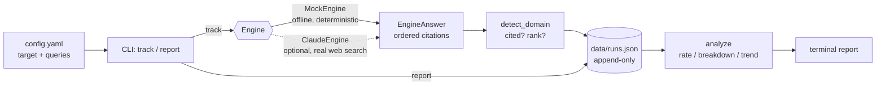

# ai-citation-tracker

> Track whether your domain/brand is cited by AI answer engines for the queries you care about — and watch that visibility trend over time.


-orange)

## Overview

Search is shifting from ten blue links to a single synthesized answer. In that
world, the question is no longer "where do I rank?" but **"does the AI cite
me?"** — this is *Generative Engine Optimization* (GEO).

`ai-citation-tracker` tracks, per query, whether a target domain shows up in an
answer engine's cited sources and at what rank, persists every run to a local
JSON store, and reports the **citation rate**, a **per-query breakdown**, and
the **trend** across runs.

> **Honesty note:** the default engine is a deterministic, fully **offline
> MOCK** (`MockEngine`). Its numbers are **illustrative** — they involve no real
> answer-engine calls. It exists so the tool, the tests, and this README run
> anywhere with zero credentials. A documented Claude provider shows how to wire
> in a real engine (see [Plugging in a real engine](#plugging-in-a-real-engine)).

## Architecture



The `Engine` interface is a structural `Protocol`: any object with a `name` and
an `answer(query) -> EngineAnswer` is an engine. The tracker never asks an
engine about the target directly — it inspects the returned citation list and
decides cited/rank in one place (`detect_domain`), which keeps engines simple
and the detection logic testable.

## Features

- **Offline-first, deterministic default** — `MockEngine` seeds citations from a
  stable hash, so results are reproducible and need no API key or network.
- **Pluggable engines** — a tiny `Protocol` interface; bring your own by
  implementing `answer()`.
- **Documented real provider** — `ClaudeEngine` (`claude-sonnet-5` + web search)
  that fails gracefully with an actionable message when the SDK or key is absent.
- **Rank-aware detection** — normalizes URLs/hosts and matches subdomains, then
  records the 1-based rank of the first match.
- **Append-only JSON store** — plain, diff-friendly history that makes trend
  analysis possible.
- **Pure analysis layer** — citation rate, per-query breakdown, and trend as
  side-effect-free functions.

## Tech stack

- **Python 3.10+**
- **[Click](https://click.palletsprojects.com/)** — CLI
- **[PyYAML](https://pyyaml.org/)** — config
- **[pytest](https://docs.pytest.org/)** — tests (offline, MockEngine only)
- **[anthropic](https://github.com/anthropics/anthropic-sdk-python)** — optional,
  only for the real Claude engine

## Getting started

```bash
# 1. Install (editable) into a virtual environment
python -m venv .venv && source .venv/bin/activate   # Windows: .venv\Scripts\activate
pip install -e .

# 2. Track your queries with the offline MOCK engine, using the shipped example config
ai-citation-tracker track -c config.example.yaml

# 3. See the report
ai-citation-tracker report -c config.example.yaml
```

Copy `config.example.yaml` to `config.yaml` and edit `target` + `queries` for
your own brand. Runs are stored in `data/runs.json` by default (gitignored).

## Usage

Running `track` against the shipped `config.example.yaml` (offline mock):

```text
$ ai-citation-tracker track -c config.example.yaml
Using the MOCK engine: results are deterministic and illustrative, with no real answer-engine calls.
  'best project management software': cited @#2
  'how to track SEO rankings': cited @#3
  'top note taking apps for teams': cited @#2
  'open source analytics tools': not cited
  'affordable CRM for small business': cited @#2
Recorded run for example.com: cited in 4/5 queries (80%). Store: data/runs.json
```

Then `report`:

```text
$ ai-citation-tracker report -c config.example.yaml
Citation report for example.com (1 run(s))
Overall citation rate: 80%

Per-query breakdown:
  100%  (1/1, best #2)  affordable CRM for small business
  100%  (1/1, best #2)  best project management software
  100%  (1/1, best #3)  how to track SEO rankings
    0%  (0/1, never cited)  open source analytics tools
  100%  (1/1, best #2)  top note taking apps for teams

Trend (rate per run, oldest first):
  2026-08-04T17:13:38+00:00   80%  (n=5)
```

Every `track` appends a run, so the **Trend** section grows a line per run. With
the mock engine the rate is stable across runs by design (it is a pure function
of the query); a real engine is where the trend becomes meaningful.

## Plugging in a real engine

The bundled `ClaudeEngine` calls Claude (`claude-sonnet-5`) with the web-search
server tool and reads the ordered result URLs as the citation list.

```bash
pip install -e ".[claude]"      # installs the optional anthropic SDK
export ANTHROPIC_API_KEY=sk-...  # or: ant auth login
ai-citation-tracker track -c config.yaml --engine claude
```

If the SDK or credentials are missing, construction raises `EngineUnavailable`
and the CLI prints an actionable message instead of a traceback — nothing
crashes and no partial run is recorded.

Writing your own engine is just implementing the `Engine` protocol:

```python
from citationtracker.engines import EngineAnswer

class MyEngine:
    name = "myengine"

    def answer(self, query: str) -> EngineAnswer:
        citations = my_search(query)          # ordered list of URLs/domains
        return EngineAnswer(engine=self.name, query=query, citations=citations)
```

## Project structure

```text
ai-citation-tracker/
├── citationtracker/
│   ├── __init__.py        # package metadata / offline-first note
│   ├── engines.py         # Engine protocol, MockEngine, ClaudeEngine, detect_domain
│   ├── analyze.py         # pure math: citation rate, per-query breakdown, trend
│   ├── store.py           # append-only JSON run store
│   └── cli.py             # Click CLI: `track` and `report`
├── tests/                 # pytest, offline, MockEngine only
├── data/                  # runtime store dir (data/*.json gitignored)
├── config.example.yaml    # target domain + tracked queries
├── pyproject.toml
├── requirements.txt
└── .github/workflows/ci.yml
```

## Testing

```bash
pip install -e ".[dev]"
pytest -q
```

The suite is fully offline (MockEngine only): it verifies the mock is
deterministic, that target detection ranks correctly, that the citation-rate /
breakdown / trend math is right, and that `track` → `report` works end to end.

## Roadmap

- CSV / JSON export of reports for dashboards
- Additional real engines (Perplexity, Gemini, ChatGPT search)
- Sentiment / answer-text capture alongside citations
- Alerting when citation rate drops below a threshold
- Simple HTML trend chart

## License

MIT — see [LICENSE](LICENSE). Copyright (c) 2026 Matthews Wong.

---

*Part of my cloud & AI portfolio — see [github.com/matthews-wong](https://github.com/matthews-wong).*
